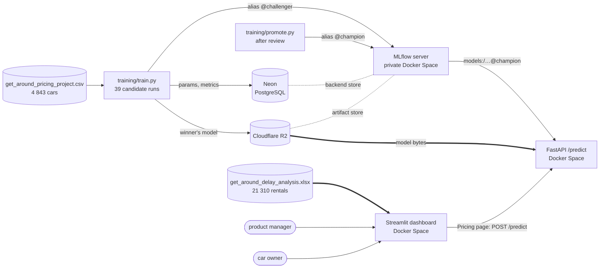
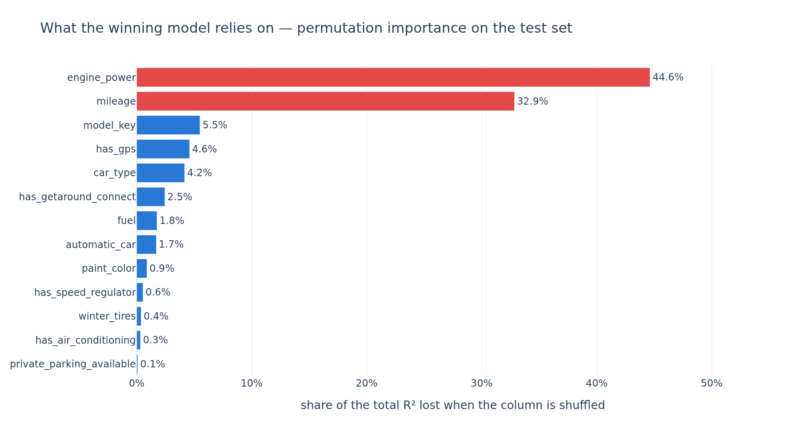

# Getaround — a buffer between rentals, and a price for a car

Two decisions for Getaround: **how long a minimum delay to impose between two rentals of the same
car**, for the product manager, and **what a car should rent for**, for its owner.

Jedha *Full Stack Data Scientist* — **Block 5, Deployment** (Getaround). scikit-learn, MLflow,
FastAPI, Streamlit, Docker, Hugging Face Spaces.

| | |
|---|---|
| 📊 **Dashboard** — delay analysis and pricing | https://lambla-getaround-delay-dashboard.hf.space |
| ⚡ **API** (`/docs` is interactive) | https://lambla-getaround-pricing-api.hf.space |
| 📊 **MLflow server** | private on purpose — see [Security](#security) |
| 📓 **How the pricing model was studied** | [`getaround_analysis.ipynb`](getaround_analysis.ipynb) |

## The problem

A driver who brings a car back late spoils the next rental: the next driver waits, and sometimes
cancels. Getaround's answer is to hide a car from search results when a requested rental would
start too soon after the previous one ends — which spares the next driver and costs bookings.

The product manager has to choose a **threshold** (how long the minimum delay is) and a **scope**
(all cars, Connect cars only — or, added here, Mobile cars only), and asked four questions to get
there. The dashboard answers each one in its own section, then weighs cost against benefit.

## Architecture



Three Hugging Face Docker Spaces, each with its own `Dockerfile` and its own `requirements.txt`,
and a Neon database and an R2 bucket that belong to this project alone.

- **Nothing reaches production without a review.** `train.py` compares every candidate in MLflow
  and registers the winner as `challenger` — and stops there. `promote.py` prints the challenger
  and the `champion` side by side and moves `champion` only if the challenger is better. The API
  serves `champion` only.
- **The model never leaves the registry.** The API loads it by **alias** at startup and only ever
  calls `.predict(...)`. Promoting a model is an alias move and a restart, not a redeployment.
- **The API holds no feature engineering.** The logged model carries the whole scikit-learn
  pipeline — scaler, one-hot encoder, regressor.
- **The column contract is written once.** The API reads the thirteen column names and their
  dtypes from the model's logged signature; the dashboard's Pricing page reads the same order
  from the API's `/health`. Neither holds a list of columns of its own.
- **No figure on `/docs` is typed by hand.** The API reads the champion's error from its own
  MLflow run at startup, so the page describes the model actually served.
- **The served versions are pinned.** scikit-learn is pinned in the model's `pip_requirements` and
  in `api/requirements.txt`, and so is `skops`, the library MLflow stores the model with: 0.16
  refuses by default to load a gradient-boosting model that 0.14 loads.
- **The dashboard's delay page holds no model.** It is pure pandas over a file shipped in its image,
  and recomputes every number on each interaction — none of them can be a stale constant.
- MLflow runs with `--no-serve-artifacts`: the model bytes travel **straight from R2** to the API,
  never through the tracking server.

## Repository layout

```
dashboard/app.py            the two pages of the web app
dashboard/delay.py          page 1 — the four questions and the recommendation
dashboard/pricing.py        page 2 — a form whose car is priced by the /predict API
dashboard/data/             the delay file and the pricing file, shipped in the image
api/                        FastAPI /predict service          (Docker Space)
training/train.py           evaluate every candidate, register the winner as challenger
training/promote.py         make the challenger the champion, if it is better
mlflow_server/              MLflow tracking server            (private Docker Space)
getaround_analysis.ipynb    how the pricing model was studied
data/                       the two source files, committed
.flake8                     the PEP8 check: flake8 dashboard/ api/ training/
.env.example                the key names the MLflow stack needs
```

## The data

| | rows | what one row is |
|---|---|---|
| `get_around_delay_analysis.xlsx` | 21 310 | one rental — car, check-in type, state, minutes late at checkout, and *when there was one within 12 hours* the previous rental of the same car and the planned gap to it |
| `get_around_pricing_project.csv` | 4 843 | one car — mileage, engine power, model, fuel, colour, body type, seven equipment options, and its daily price |

The delay file carries its own documentation sheet. Each file answers its own half of the brief.

## How the delay analysis counts

Five decisions, each written on the dashboard next to the number it shapes:

1. **A rental is exposed** when `time_delta_with_previous_rental_in_minutes` is filled — it follows
   another rental of the same car by less than 12 hours. No other rental can ever be hidden.
2. **A rental is blocked** when that planned gap is shorter than the threshold. In such a pair the
   rule hides the later rental, so the pair is counted once, on the later rental's row.
3. **The cost side (Q1, Q2) counts ended rentals only.** A cancelled rental earned nothing, so
   hiding it costs nothing.
4. **The benefit side (Q3, Q4) counts every pair**, cancelled next rentals included: a problem
   exists whether or not the next driver went on to cancel.
5. **A pair's scope is the check-in type written on its own row**, nothing guessed.

A **problematic case** is an *overlap*: the previous driver came back after the next check-in was
due. It needs the previous checkout time, which 112 pairs lack; they are left out of Q3 and Q4
rather than imputed.

## What we found

### Q1 — at most 8.93% of the owners' revenue is exposed

1 612 of the 18 045 ended rentals follow another rental of the same car within 12 hours: 3.78%
on Connect cars, 5.15% on Mobile ones. Every ended rental counts as the same revenue, since the
file records neither a price nor a duration.

### Q2 — a threshold blocks a part of that ceiling

At 30 minutes the rule blocks **244 ended rentals (1.35%)**; at 60 minutes, 358 (1.98%). The gap is
recorded in steps of 30 minutes, so a 30-minute threshold forbids exactly one thing: a rental
starting the very minute the previous one ends.

### Q3 — 12.6% of chained pairs overlap, and long overlaps go with cancellations

57.5% of drivers return the car late, but only **218 of the 1 729 measurable pairs (12.6%)** come
back after the next check-in was due — 8.7% of Connect pairs, 15.9% of Mobile ones. When it
happens, the next driver waits 26.5 minutes (median).

| overlap | pairs | next rental cancelled |
|---|---|---|
| none | 1 511 | 11.2% |
| 0–30 min | 115 | 8.7% |
| 30–60 min | 37 | 21.6% |
| 1–2 h | 25 | 12.0% |
| over 2 h | 41 | **39.0%** |

Only the longest overlaps stand clearly apart, and the bands past half an hour rest on a few dozen
pairs. It is a correlation: the file records neither the reason nor the date of a cancellation.

### Q4 — a threshold solves a part of the 218 cases

At 30 minutes the rule solves **116 of the 218 problematic cases (53%)**; at 60 minutes, 146 (67%).

## The recommendation: 30 minutes, on all cars

| threshold | ended rentals blocked | cases solved | blocked per case | extra blocked per extra case |
|---|---|---|---|---|
| **30 min** | **244** | **116** | **2.10** | 2.1 |
| 60 min | 358 | 146 | 2.45 | 3.8 |
| 90 min | 518 | 172 | 3.01 | 6.2 |
| 2 h | 592 | 180 | 3.29 | 9.2 |

30 minutes is the cheapest step on the curve: 1.35% of ended rentals for half the problematic
cases. **There is no elbow beyond it**: the average cost per case rises at every threshold, and
every later step costs at least 3.8 blocked rentals per extra case. Whether a longer threshold is
worth it is a price the company sets, not a result of this data.

**All cars, rather than one check-in type.** At 30 minutes, Connect-only costs 2.73 blocked
rentals per case solved, Mobile-only 1.78, all cars 2.10. Connect drivers overlap the next check-in
less often, so Connect-only is the most expensive scope per case; Mobile-only is the cheapest, but
leaves all 69 Connect cases unsolved.

What the data cannot say: whether a blocked driver books another slot or another car (the cost is
an upper bound), and whether a solved case stays solved if that driver rebooks the same car.

## The pricing model

`training/train.py` evaluates **39 candidates, one MLflow run each**, on the same split and the
same five folds: the median price as a baseline, a linear regression, a random forest in a
single configuration, and a gradient boosting over a grid of 36 combinations. The winner is chosen on **cross-validated MAE**
— measured on the training split only, so that its held-out MAE stays honest for the comparison
`promote.py` makes with the champion.

| model | CV MAE | test MAE |
|---|---|---|
| the median price of every car | €23.44 | €24.13 |
| linear regression | €12.34 | €12.41 |
| random forest | €10.59 | €10.88 |
| **gradient boosting** (learning_rate 0.05, 400 iterations, 31 leaves, 10 per leaf) | **€10.34** | **€10.59** |

MAE because it reads in euros, as an owner thinks about a price, and because a handful of unusual
cars cannot dominate it the way they would dominate an RMSE. Half the cars are priced within
**€7.12**.



`engine_power` and `mileage` carry **75% of the model**; the seven equipment options and the
colour together under 10% (see the notebook). Fitted on the car's own characteristics alone it
reaches CV R² 0.717; adding everything the owner controls takes it to 0.755. `/predict` therefore
answers **"what is my car worth"**, not "what should I change" — a market rate, and it should be
presented as one.

## Running it locally

```bash
python3 -m venv .venv
.venv/bin/pip install -r requirements.txt
```

**Dashboard.** Its Pricing page calls the API at `PRICING_API_URL`, the online Space by default:

```bash
.venv/bin/pip install -r dashboard/requirements.txt
.venv/bin/streamlit run dashboard/app.py
```

**API and training** need the MLflow stack, so they need credentials:

```bash
cp .env.example .env                              # then fill in your own
.venv/bin/pip install -r training/requirements.txt
.venv/bin/python training/train.py                # 39 runs, winner registered as @challenger
.venv/bin/python training/promote.py              # review, then @champion if it is better
```

`train.py` never overwrites a version and never touches `champion`; `promote.py` moves `champion`
only when the challenger's held-out MAE is lower, and says so either way.

**Both services in Docker**, the dashboard calling the API container:

```bash
docker network create getaround
docker build -t getaround-api api/
docker build -t getaround-dashboard dashboard/
docker run -d --name api --network getaround -p 8000:7860 --env-file .env getaround-api
docker run -d --network getaround -p 8501:7860 -e PRICING_API_URL=http://api:7860 getaround-dashboard
```

**Code style.** `.venv/bin/flake8 dashboard/ api/ training/` checks PEP8, with the line limit
raised to 99 in `.flake8`.

## Security

The MLflow server stays **private**, and not by oversight: MLflow ships no authentication of its
own, so the Space's privacy *is* the access control. Made public, its API would be open for writing
— anyone could move the `champion` alias and the pricing endpoint would serve a different model at
its next restart, without a single error.

## Stack

pandas · scikit-learn · MLflow · Neon PostgreSQL · Cloudflare R2 · plotly · FastAPI · Streamlit ·
Docker · Hugging Face Spaces
