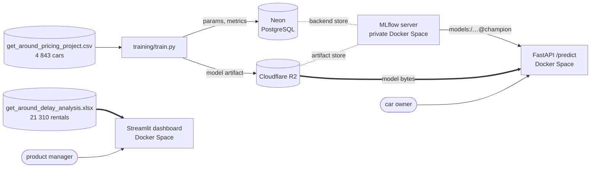
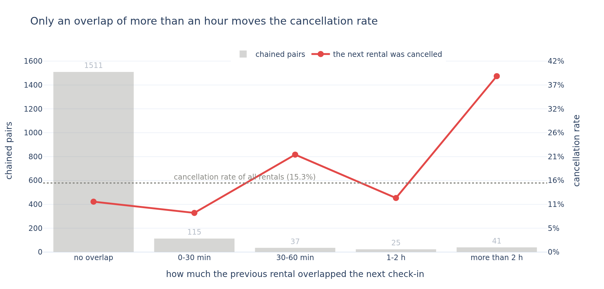
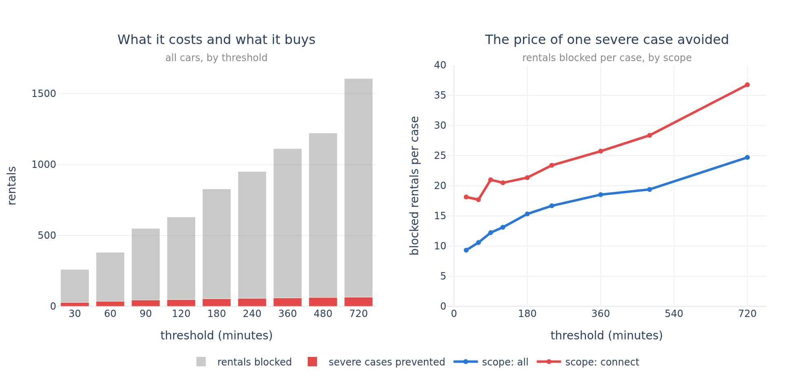

# Getaround — a buffer between rentals, and a price for a car

Two decisions for Getaround's product team, from 21 310 rentals and 4 843 cars: **how long a
minimum delay to impose between two rentals of the same car**, and **what a car should rent for**.

Jedha *Full Stack Data Scientist* — **Block 5, Deployment** (Getaround). scikit-learn, MLflow,
FastAPI, Streamlit, Docker, Hugging Face Spaces.

| | |
|---|---|
| 📊 **Dashboard** | https://lambla-getaround-delay-dashboard.hf.space |
| ⚡ **API** (`/docs` is interactive) | https://lambla-getaround-pricing-api.hf.space |
| 📊 **MLflow server** | private on purpose — see [Security](#security) |
| 📓 **The analysis** | [`getaround_analysis.ipynb`](getaround_analysis.ipynb) |

## The problem

A driver who brings a car back late ruins the next rental: the next driver waits, and sometimes
cancels. Getaround's answer is to hide a car from search results when the requested check-in is too
close to the previous checkout — which solves the friction and costs bookings.

The product manager has to decide **a threshold** and **a scope**, and asked four questions to get
there: what share of revenue the feature would affect, how many rentals it would block, how often
drivers are actually late, and how many problems each setting would solve.

All four are answered below and in the dashboard. Two of the answers are not the expected ones:

> **The feature's entire target is 66 rentals out of 21 310** — the cases where the previous driver
> came back more than an hour after the next check-in was due, which is where the next rental's
> cancellation rate actually moves. Avoiding one of them costs between **10 and 25 blocked
> rentals**, and the ratio only worsens as the threshold grows. There is no optimum on the curve,
> only a price per avoided incident.
>
> **"Connect cars only" is the wrong scope, for the opposite of the expected reason.** Connect
> drivers are *less* late than mobile ones — 43% against 61%. Connect is where the problem shows up
> because Connect cars are chained back-to-back three times more often, not because their drivers
> behave worse. Restricting the feature there costs **17.7 blocked rentals per severe case avoided
> against 10.6** for all cars.

## Architecture



Three Hugging Face Docker Spaces, each with its own `Dockerfile` and its own `requirements.txt`,
and a Neon database and R2 bucket that belong to this project alone. The split is deliberate:

- **the model never leaves the registry.** `training/train.py` logs the fitted pipeline and
  registers it; the API loads it by **alias** and only ever calls `.predict(...)`. It reads no
  local model file. Promoting a new model is an alias move, not a redeployment.
- **the API holds no feature engineering.** The logged model carries the *whole* scikit-learn
  pipeline — scaler, one-hot encoder, regressor. A served model that reproduces its own
  preprocessing is one that quietly stops matching its notebook the first time an encoder changes.
- **the column contract comes from the logged signature.** The API reads the thirteen column names
  *and their dtypes* from `MODEL.metadata.get_input_schema()`, so the order a caller must respect
  is written once, by the training script, and never twice.
- **the model pins its own scikit-learn version** in its `pip_requirements`, and
  `api/requirements.txt` pins the same one. Unpickling under a different minor version works and
  only warns, which is exactly the risk: a silent change of behaviour in a served model is the
  failure nobody notices.
- **the dashboard holds no model and calls no API.** The delay analysis is pure pandas over a
  751 KB file shipped in its image, so the page starts in seconds and every figure on it is
  recomputed live — no number can be a stale constant copied out of the notebook.
- MLflow runs with `--no-serve-artifacts`: it hands out an `s3://` URI and the model bytes travel
  **straight from R2** to the API, never through the tracking server. That is why both clients
  carry `boto3` and the server stays responsive on the smallest hardware.
- **the stack is this project's own.** Its own tracking Space, its own Neon database, its own R2
  bucket — nothing is shared with another project, so revoking any credential here affects this
  project and no other.

## Repository layout

```
getaround_analysis.ipynb    the analysis — sections 1 to 7, delay and pricing
training/train.py           fit the pricing model, log it, register it, move the alias
api/                        FastAPI /predict service          (Docker Space)
dashboard/                  Streamlit delay dashboard         (Docker Space)
mlflow_server/              MLflow tracking server            (private Docker Space)
data/                       the two source files, 1.2 MB, committed
images/                     the four figures, also embedded in the notebook
requirements.txt            pinned versions for the notebook
.env.example                the key names the MLflow stack needs
```

## The data

Two files, and **they cannot be joined**: the pricing file has no car identifier, so no rental can
be given a price.

| | rows | what one row is |
|---|---|---|
| `get_around_delay_analysis.xlsx` | 21 310 | one rental — car, check-in type, state, minutes late at checkout, and *when there was one* the previous rental and the gap to it |
| `get_around_pricing_project.csv` | 4 843 | one car — mileage, engine power, model, fuel, colour, body type, seven equipment options, and its daily price |

That missing join is the single biggest limit on the analysis, and it is why **every cost in this
repository is a count of rentals standing in for euros**.

Two things in the delay file look like they need a cleaning rule. Neither gets one, and the
notebook prices both decisions:

- **The delays run from 15 days early to 49 days late.** No rule is applied, because every question
  here is answered by a *share* — how many drivers are late, how many overlap — and a share does
  not move when a tail is trimmed. The one figure a tail would distort is a mean delay, which the
  notebook never uses.
- **1 700 ended rentals have no checkout time** (11.0% on mobile against 3.1% on Connect). They
  stay in every denominator. 112 chained pairs lose their previous checkout that way and are
  carried as a stated blind spot rather than imputed.

Three rows of the pricing file *are* dropped: a mileage of −64 km, one of 1 000 376 km, and an
engine of 0 hp. That is 0.06% of the file, too small to change a score — they go because serving a
prediction fitted on a negative mileage is indefensible, not because it helps.

## What we found

### Only 8.6% of rentals can be touched at all, and the real target is 66 of them



**1 841 of the 21 310 rentals follow another rental of the same car.** Of the 1 729 whose previous
checkout is recorded, half the previous drivers are late by *something* — and it usually does not
matter. **218 actually overlap** the next check-in, and only **66 overlap by more than an hour.**

That last threshold is not arbitrary. The next rental's cancellation rate is **8.7% after an
overlap under half an hour** — *below* the 15.3% baseline — and reaches **39.0% beyond two hours**.
Two warnings belong on the same line as that number: the right-hand half of the chart rests on 103
pairs, and a cancellation recorded after a late checkout is a correlation, since the file holds no
cancellation reason.

### Every threshold is a price, and the price only rises



| threshold | rentals blocked | severe cases prevented | blocked per case |
|---|---|---|---|
| 30 min | 261 (1.22%) | 28 of 66 | **9.3** |
| **60 min** | **381 (1.79%)** | **36 of 66** | **10.6** |
| 3 h | 828 (3.89%) | 54 of 66 | 15.3 |
| 12 h | 1 606 (7.54%) | 65 of 66 | 24.7 |

The ratio rises monotonically. **There is no threshold at which this trade is efficient** — the
question is not where the optimum sits but how much the company will pay per avoided incident, and
the cheapest useful setting is the smallest one.

**Sixty minutes, all cars** is the recommendation: 1.79% of rentals removed from search results,
55% of the severe cases prevented.

### Connect concentrates the chaining, not the lateness

|  | late at all | median delay | chained | severe overlaps |
|---|---|---|---|---|
| **connect** | 42.9% | −9 min | **18.9%** of its rentals | 2.5% of its chained pairs |
| **mobile** | 61.4% | +14 min | 6.1% of its rentals | 4.9% of its chained pairs |

Connect drivers open the car with a phone and nobody waits for a handover, and it shows in every
column. Narrowing the feature to Connect aims it at the punctual half of the fleet: 177 blocked
rentals for 10 severe cases, **17.7 per case against 10.6**.

### The price is the car, not the equipment


The pricing model is a tuned gradient-boosting regressor: **€10.59 of average error on a median
price of €120**, half the cars within €7.12, against €24.13 for charging every car the same.

| model | CV R² | test MAE |
|---|---|---|
| the median price of every car | −0.009 | €24.13 |
| linear regression | 0.697 | €12.41 |
| random forest | 0.748 | €10.88 |
| **gradient boosting, tuned** | **0.762** | **€10.59** |

`engine_power` and `mileage` carry **75% of the model**; the seven equipment booleans and the paint
colour together are 9.9%. Fitted on the car's own characteristics alone it reaches CV R² 0.717;
adding everything the owner controls takes it to 0.755 — under four points. Those options fitted
*alone* reach 0.344.

`/predict` therefore answers **"what is my car worth"**, not "what should I change". That is the
right answer for an owner setting a price, and the wrong one to sell as an optimiser.

## What Getaround should do

1. **Set the buffer to 60 minutes, on all cars.** 1.79% of rentals, 55% of the cases where the
   cancellation rate actually moves.
2. **Do not restrict the scope to Connect** — it is the punctual half of the fleet, and its cars
   rent for 19% more, so each blocked rental costs more too.
3. **Expect the feature to be small.** Its whole target is 66 rentals in 21 310. Worth shipping
   because a driver standing in the street is a bad experience, not because the numbers are large.
4. **Log three columns and this becomes a revenue analysis:** `car_id` in the pricing export, and
   the rental's start and end.
5. **Present `/predict` as a market rate**, because that is what it is.

## Running it locally

```bash
python3 -m venv .venv
.venv/bin/pip install -r requirements.txt
```

Open `getaround_analysis.ipynb` and select the `.venv` kernel. It executes end to end in about a
minute, needs no credential and no network, and writes the four figures to `images/`.

Charts render as static images so the notebook stays readable on GitHub, which strips interactive
plotly output; the same PNGs are written to `images/`. If `kaleido` cannot find a browser, run
`.venv/bin/plotly_get_chrome`. Everything is seeded on `RANDOM_STATE = 42`, so a re-run reproduces
every number above.

Registering a model needs the MLflow stack, so it needs credentials:

```bash
cp .env.example .env          # then fill in your own
.venv/bin/pip install -r training/requirements.txt
.venv/bin/python training/train.py
```

`train.py` is idempotent in the sense that matters: re-running it creates a **new version** of the
registered model and moves `champion` to it. It never overwrites a version.

Each service is built from its own directory, and both need the same `.env`:

```bash
docker build -t getaround-api api/             && docker run --rm -p 8000:7860 --env-file .env getaround-api
docker build -t getaround-dashboard dashboard/ && docker run --rm -p 8501:7860 getaround-dashboard
```

The dashboard needs no credential — it reads a file shipped in its own image.

## Security

The MLflow server stays **private**, and not by oversight: MLflow ships no authentication of its
own, so the Space's privacy *is* the access control. Made public, its API would be open for writing
— anyone could move the `champion` alias and the pricing endpoint would serve a different model at
its next restart, without a single error.

## Stack

pandas · scikit-learn · MLflow · Neon PostgreSQL · Cloudflare R2 · plotly · FastAPI · Streamlit ·
Docker · Hugging Face Spaces
